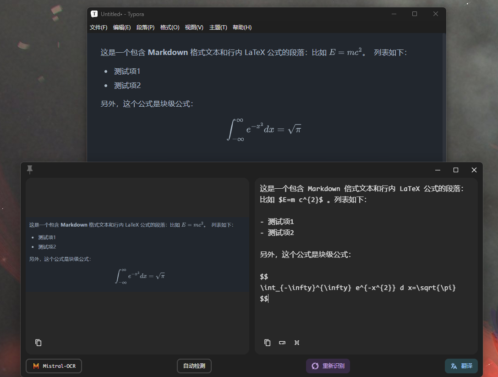

# Pot-App Mistral-OCR

## 文档OCR（光学字符识别）处理器
由Mistral最新的OCR模型mistral-ocr-latest驱动，使您能够从文档中提取文本和结构化内容。

## 关键特性包括：
• 在保持文档结构和层次的同时提取文本内容

• 保留标题、段落、列表和表格等格式

• 以Markdown格式返回结果，便于解析和呈现• 处理复杂布局，包括多栏文本和混合内容

访问[Mistral_console](https://console.mistral.ai/api-keys)获取api_key

